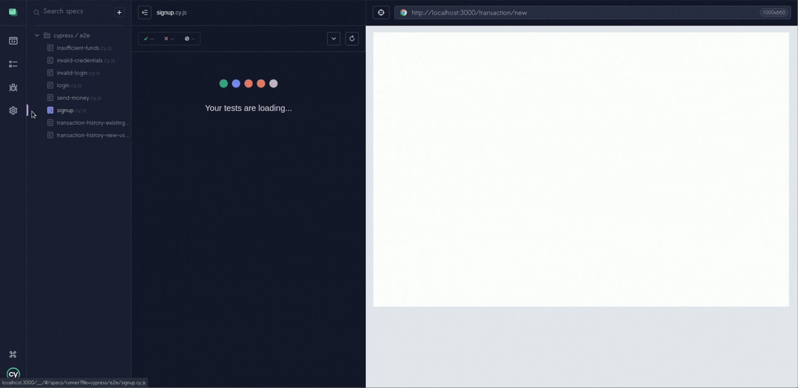
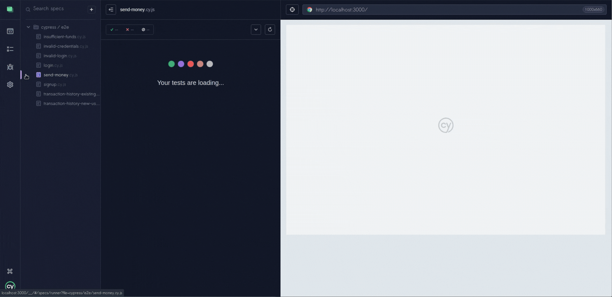

# Cypress E2E Tests — Real World App


## Test Automation Project

This repository contains automated end-to-end test scenarios developed using **Cypress** as part of the QA training program **Guardião da Qualidade (LumeStack)**.

The project is based on the **Real World App**, an open-source banking application simulation designed to practice real-world testing workflows such as authentication validation, user interactions, and financial transactions.

The goal of this project is to demonstrate practical experience with **automated testing**, covering both **positive and negative scenarios** in a realistic application environment.

---

## About the Real World App

The Real World App is an open-source project created to simulate the behavior of a real banking application for testing purposes.

Original project repository:

https://github.com/cypress-io/cypress-realworld-app

---

## Testing Approach

This project was implemented using **Cypress with Custom Commands** to improve test readability and reduce code duplication.

Instead of using the `Page Object Model`, the tests focus on Cypress-native patterns and reusable commands to keep the test suite simple, maintainable, and expressive.

---

## Technologies Used

- Cypress
- JavaScript
- Node.js

---

## Test Scenarios Covered

The automated tests cover key user flows within the application:

- User sign-up

## Test Execution Example

The following demonstration shows the automated **user sign-up flow** executed with Cypress.  
The test fills the registration form with valid credentials and verifies that the user can successfully create an account.


- Successful login
- Invalid login validation
- Send money
- Send money with insufficient funds
- Transaction history
- New user transaction flow
- Existing user transaction flow

---

## Demonstrated Test Scenarios

Below are demonstrations of the automated end-to-end test scenarios executed with Cypress.

Each scenario represents a real user flow covered by the test suite.

### User Signup

Validates the user registration flow.



### Successful Login

Validates login with valid user credentials.


### Invalid Login

Validates system behavior when invalid credentials are used.


### Send Money

Validates the money transfer flow between users.



### Send Money with Insufficient Funds

Documents the behavior when a user attempts a transfer without sufficient balance.


### Transaction History

Validates whether the transaction history is correctly displayed.


### New User Transaction Flow

Validates the first transaction flow for a newly created user.


### Existing User Transaction Flow

Validates the transaction behavior for an existing user.


---

## Project Structure

```
real-world-app-cypress-tests
│
├── cypress
│   ├── e2e
│   │   ├── login.cy.js
│   │   ├── signup.cy.js
│   │   ├── transactions.cy.js
│   │   └── transfers.cy.js
│   │
│   ├── fixtures
│   │
│   └── support
│       ├── commands.js
│       └── e2e.js
│
├── cypress.config.js
├── package.json
└── README.md
```

This structure organizes the Cypress test suite following best practices, separating test scenarios, fixtures, and support commands for better maintainability.

## How to Run the Tests

### 1. Clone the repository

```bash
git clone https://github.com/pedrogitahy-qa/real-world-app-cypress-tests
cd real-world-app-cypress-tests

npm install

npx cypress open

npx cypress run

```markdown
## Demonstrated Test Scenarios


